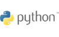

<h1 align="center">
StereoChem : Explore the world of isomers through a fun game 
</h1>

<br>

### Collaborators: Catherina Carrer, Lucie Frenot, Mridhula Jayasankar ＆ Rania Doukkali
#### Practical Programming in Chemistry @ EPFL

## 🖊 Introduction 

This project was created as part of the Practical Programming in Chemistry course at EPFL, Spring 2025. It’s all about diving into the world of coding and getting hands-on with GitHub. As second-year chemistry students, we’re blending science with software to build something cool—and learning a ton along the way!

## 📖 Package description 

This package allows users to get familiar with the different isomers of any molecule of their choice. It does so through a fun and interactive guessing game, making the learning enjoyable and engaging. Whether you are trying to understand this complicated chapter in chemistry or just wanting to explore a new aspect of this subject, this package offers a lively way to explore isomers. 

The main isomers involving this package are: 
-	R and S stereoisomers
- list all the isomers 

## ⚛ What are isomers ? 

All chemical molecules can be represented in several ways one of which is the chemical formula- a universal method of notation. When two or more molecules have the same chemical formula but differ in the arrangement of their atoms, they are known as isomers.

Their importance in chemistry arises from the fact that two molecules having the same chemical formulas differ in more ways than just their arrangement as this gives rise to different physical and chemical properties. Indeed, the differences can vary from the boiling point to polarization of light to even difference in reactivity with receptors in our body for pharmaceutical chemicals for instance. 

Explain quickly the isomers which will be encountered in the package!!!!

## 👩‍💻 Installation

Create a new environment, you may also give the environment a different name. 

```
conda create -n stereochem python=3.10 
```

```
conda activate stereochem
(conda_env) $ pip install .
```

If you need jupyter lab, install it 

```
(stereochem) $ pip install jupyterlab
```

As this package requires a few external packages please install the following if they don’t appear in your environment. In order to check if *rdkit3*, *streamlit*, *streamlit_ketcher* and *pubchempy* are already 
installed run:

```
(stereochem) $ conda list
```

If they don't appear, please install them individually: 

```
(stereochem) $ pip install rdkit 
(stereochem) $ pip install streamlit 
(stereochem) $ pip install streamlit_ketcher
(stereochem) $ pip install pubchempy 
```

## 🛠️ Development installation

Initialize Git (only for the first time). 

Note: You should have create an empty repository on `https://github.com:mridhula28/StereoChem`.

```
git init
git add * 
git add .*
git commit -m "Initial commit" 
git branch -M main
git remote add origin git@github.com:mridhula28/StereoChem.git 
git push -u origin main
```

Then add and commit changes as usual. 

To install the package, run

```
(stereochem) $ pip install -e ".[test,doc]"
```

## 🔥 Usage 

```python
from mypackage import main_func

# One line to rule them all
result = main_func(data)
```

This usage example shows how to quickly leverage the package's main functionality with just one line of code (or a few lines of code). 
After importing the `main_func` (to be renamed by you), you simply pass in your `data` and get the `result` (this is just an example, your package might have other inputs and outputs). 
Short and sweet, but the real power lies in the detailed documentation.

### Run tests and coverage

```
(conda_env) $ pip install tox
(conda_env) $ tox

