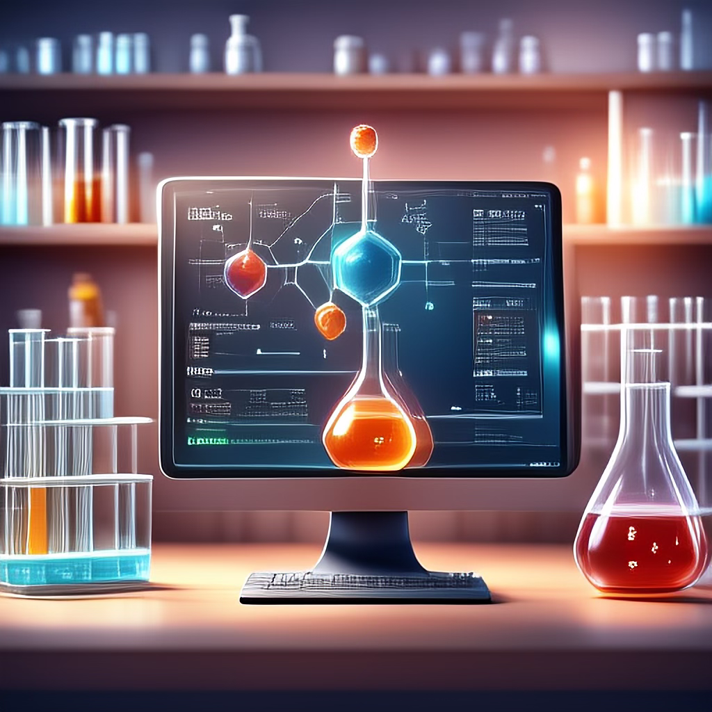
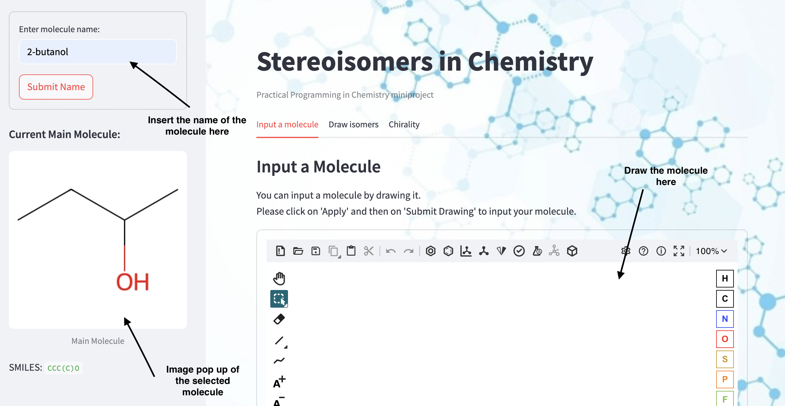
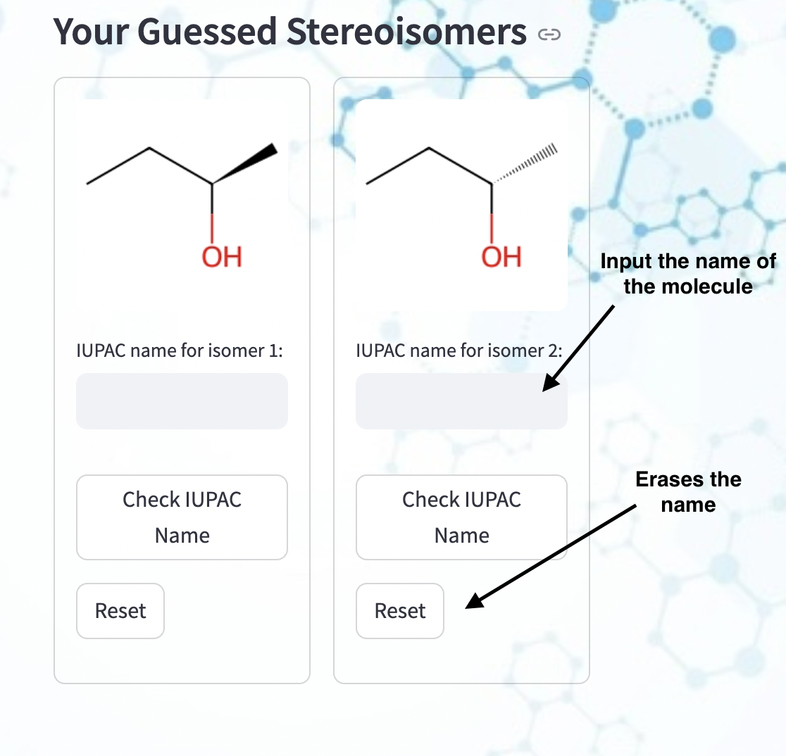
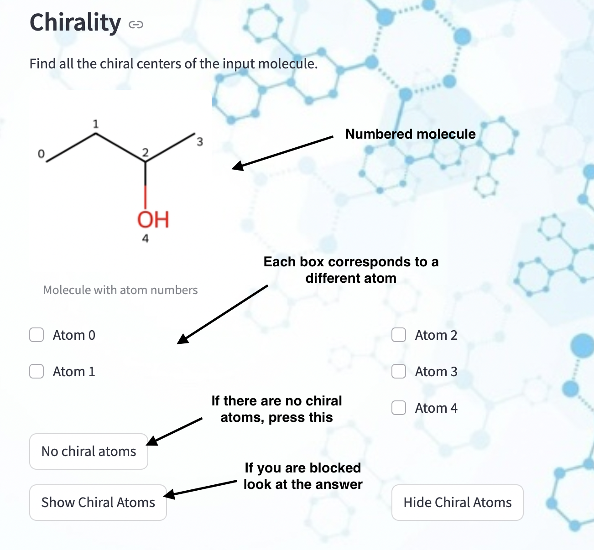
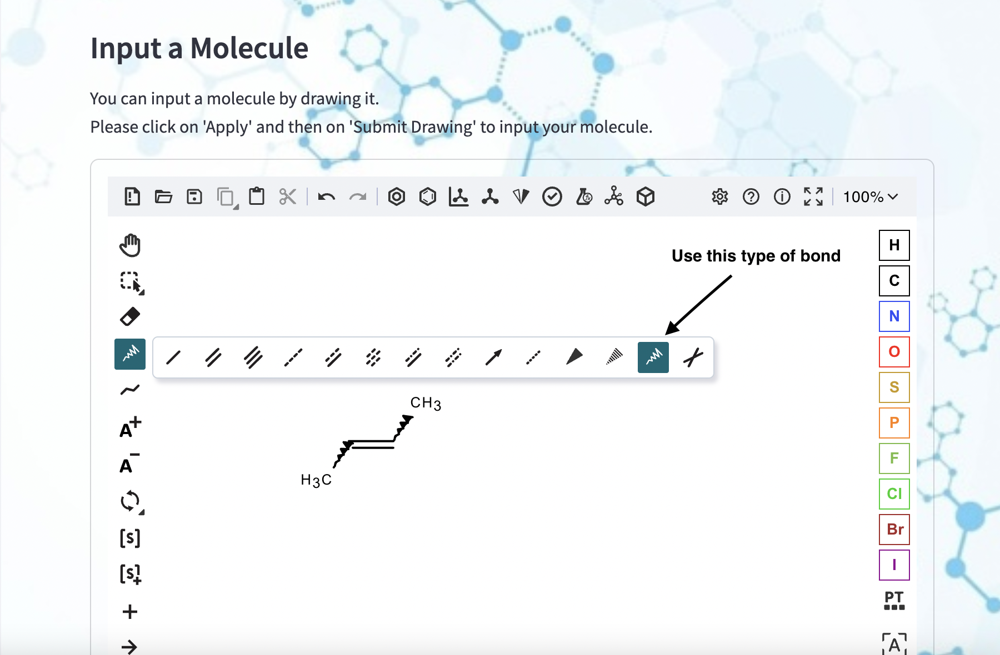

<h1 align="center">
StereoChem : Explore the world of isomers through a fun game 🎈
</h1>

<br>

### Collaborators: Catherina Carrer, Lucie Frenot, Mridhula Jayasankar ＆ Rania Doukkali
#### Practical Programming in Chemistry @ EPFL

## 📖 Package description 

Welcome to the world of isomers! If you are struggling to understand the chapter of isomers in chemistry, then this educational game is for you. 

Through an exciting interactive game, this package unables the user to get familiar with optical stereoisomers and additionally the chirality of a given molecule by making the learning enjoyable and engaging. Whether you are trying to understand this complicated chapter in chemistry or just wanting to explore a new aspect of this subject, this package offers a lively way to explore enantiomers, non-superposable mirror images, and diastereoisomers, non-mirror image optical isomers. 


## ⚛ What are isomers and chirality ? 

All chemical molecules can be represented in several ways one of which is the chemical formula, a universal method of notation. When two or more molecules have the same chemical formula but differ in the arrangement of their atoms giving rise to different physical and chemical properties, they are known as isomers.

Being linked to enantiomers, chirality represents the property of a molecule making it non superposable to its mirror image. Having a hard time finding them? It is easy find a carbon atom with four different constituents and you are all done. 


## 👩‍💻 Installation

Have we motivated you to come along the wonderful experience of StereoChem with us ? Start by creating a new environment! You may also give the environment a different name. 

```
conda create -n stereochem python=3.8 
```

```
conda activate stereochem
```

Now lets create a folder in this environment and enter the folder! Once again you may name the folder as you wish. 

```
mkdir teststereo
```
```
cd teststereo
```

Use the following line to clone the github repository: 

```
git clone https://github.com/mridhula28/Stereochem
```

Then install the package using: 

```
pip install -e .
```

As this package requires a few external packages please install the following if they don’t appear in your environment. In order to check if *rdkit3*, *streamlit*, *streamlit_ketcher* and *pubchempy* are already 
installed run:

```
(stereochem) $ conda list
```

If they don't appear, please install them individually: 

```
(stereochem) $ pip install rdkit 
(stereochem) $ pip install streamlit 
(stereochem) $ pip install streamlit_ketcher
(stereochem) $ pip install pubchempy 
```

## 🔥 Usage 

Once all the boring installation work is done, the fun can start!
Open the `src` folder and open the `stereochem_project` file. Go to the terminal and type in: 

```
streamlit run src/stereochem/stereochem_project.py    
```

Executing this code will automatically bring you to the our web page. 
Here is a short user manual to help you get familiar with the web interface.

Start by entering the name of a molecule either by typing it in the sidebar and pressing on `Submit Name` or by drawing it directly on the interface and then clicking on `Apply` and `Submit drawing`. An example with **butan-2-ol**



Switch tabs and go to the **Draw isomers** tab. 
Guess all the stereoisomers on the interface and press on `Apply` and `Submit drawing` to validate your guess. If you are blocked press on `hint` or if you wish to give up and have the answers press on `Show Answers`

For each correct stereoisomer guessed, a small pop up card will appear. Try and the guess the iupac name of the molecule you just drew! 



Switch tabs and go to the **Chirality** tab. 
Click on the numbered boxes of the atoms you think are chiral.



If you wish to guess stereoisomers for molecules with double bond, please used the donc representation shown on the bellow image. This allows not to predefine a configuration for the given molecule. 



### 📚 Authors 

Developers: 
- Catherina Carrer, student in chemistry and chemical engineering at EPFL [](https://github.com/CatherinaCarrer)
- Lucie Frenot, student in chemistry and chemical engineering at EPFL [](https://github.com/frenot)
- Mridhula Jayasankar, student in chemistry and chemical engineering at EPFL [](https://github.com/mridhula28)
- Rania Doukkali, student in chemistry and chemical engineering at EPFL [](https://github.com/RaniaDoukkali)

All developers contributed to the creation of the interface. The **stereoisomers** component of the code was primarily developed by **Lucie** and **Catherina**, while the **nomenclature** and the **results** were mainly implemented by **Rania**. The **chirality** functionality of tab 3 was developed by **Mridhula**. Additionally, the **Jupyter Notebook** and **testing scripts** were written by Lucie, Catherina and Rania. Finally, the **README** was authored by Mridhula.

It's important to note that we did not assign rigid roles within the team—each developer contributed across different aspects of the project, collaborating and supporting one another throughout the development process.